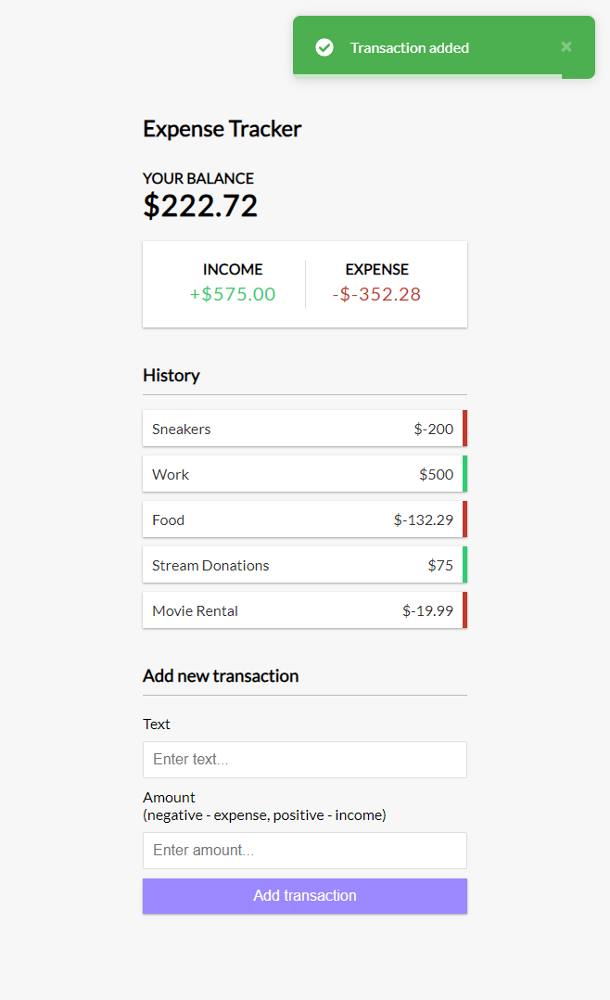

# Vue 3 Expense Tracker

An expense tracker app built with Vue 3 and the composition API.

- Add and remove expenses/income
- Track balance
- Save data to local storage
- `<script setup>` syntax (Vue 3.2+)

